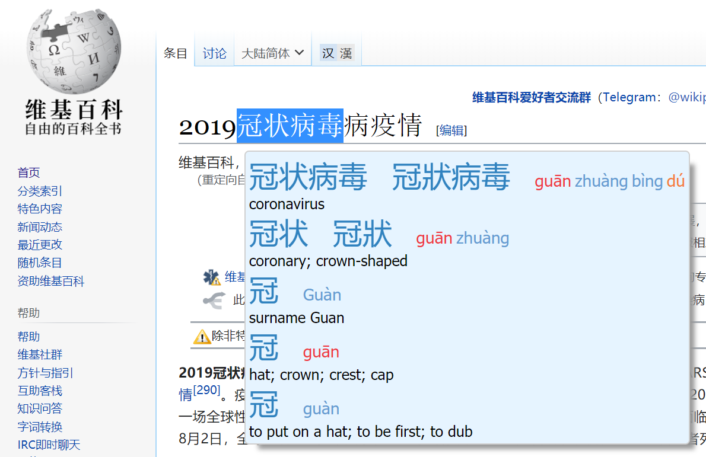
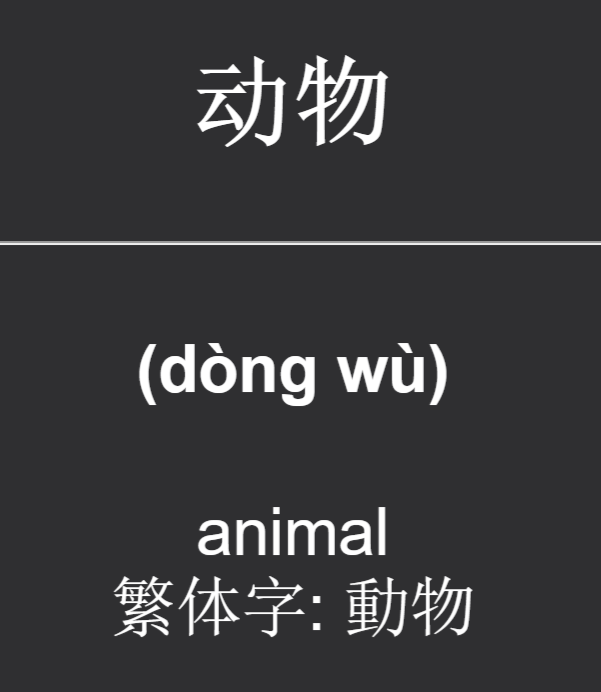
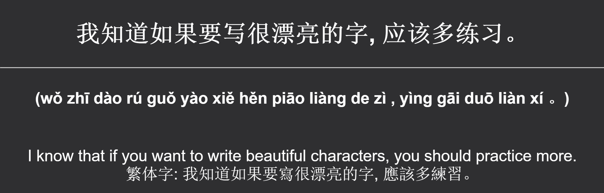

# 好好学习 ⛽ 

HaoHaoXueXi is a command line power tool for generating and exporting Chinese language learning flashcards into Anki.

**Features**:
- Save exports from popular apps like Pleco and ZhongWen straight into Anki
- Generate cards from custom word and sentence lists
- Automatically generate Google translations, pinyin, CE-CCDICT definitions, and traditional/simplified characters
- Format output Anki cards with HTML

**Requirements**:
- Python v3.6 or above
- Anki installed and running with the [AnkiConnect](https://ankiweb.net/shared/info/2055492159) plugin installed (Visit http://localhost:8765 to test AnkiConnect)

## Motivation

The [Zhongwen Chrome extension](https://chrome.google.com/webstore/detail/zhongwen-chinese-english/kkmlkkjojmombglmlpbpapmhcaljjkde?hl=en) is fantastic for quickly finding character pinyin with a simple mouse hover, saving it to a word list, and exporting it to a text file.



Saving the above card would generate a text file with:

`冠状病毒	冠狀病毒	guān zhuàng bìng dú	coronavirus`

However, these text exports aren't in the right format for Anki imports, and doing it manually is laborious. There is also little room for customizing the card format.

This script converts Zhongwen, Pleco, and any other text files containing Chinese content and definitions into ANKI Cards with custom formatting.

## Usage

### Word card exports from Pleco or Zhongwen

Use like:

```
hhxx 
--input ../path/to/Zhongwen-Words.txt
--type "zhongwen"
--front "{content}"
--back "<h2>({{pinyin}})</h2> <br /> {{translation}} <br /> Traditional: {{oppositeCharacters}}"
--deck "Vocabulary"
```

### Custom Word cards

Let's say you've got your own CSV word list which contain simplified chinese words with their definitions. You would like to generate ANKI Cards that also contain the pinyin and traditional character equivalents.

Input text file:
```
动物,animal
动物园,zoo; zoological garden
奋斗,struggle; fight
千年,millennium
```

Specify the input format with `"{content} {definition}"` and set comma as the delimiter, then design your output Anki cards with specifiers like `{pinyin}` and `{oppositeCharacters}`
```
hhxx
--input words.txt
--format "{content} {definition}"
--front "<h2>{content}</h2>"
--back "<h4>({pinyin})</h4> <br /> {definition}<br /> 繁体字: {oppositeCharacters}"
--deck "Words"
--delimiter ','
```

The above generates a card that looks like:



### Custom Sentence cards

If you have a list of sentences, in addition to the fields above, `hhxx` can also generate Google translations.

Input text file:
```
我知道如果要写很漂亮的字, 应该多练习。
我认为认识汉字不太难，可是记着怎么写字特别难。
繁体字有很多历史和文化，但是写着不容易。
```

You can import this text file with a custom input format with a single `{content}` column, and use `{translation}` in the card back.
```
hhxx
--input sentences.txt
--format "{content}"
--front "<h2>{content}</h2>"
--back "<h4>({pinyin})</h4> <br /> {translation}<br /> 繁体字: {oppositeCharacters}"
--deck "Sentences"
--no-delete
```

The translation will be generated through Google translate, and pinyin and traditional characters will be added. If you prefer traditional characters on the front, pass the `--traditional` flag, and the opposite character set will be simplified characters. Note that the script also converts words into your preferred character set - if you pass an input with traditional character content but prefer simplified chinese, it will be converted to simplified.

The above will generate a card that looks like:



好吧，去好好学习! ⛽